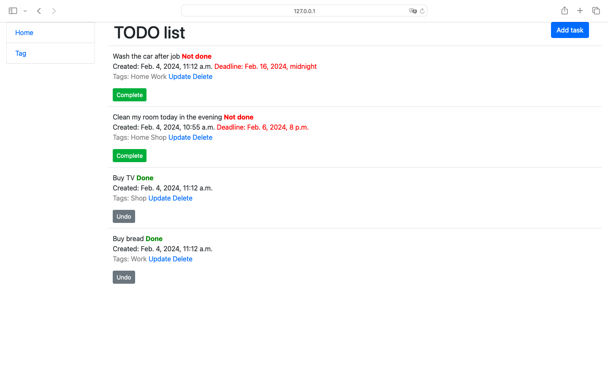
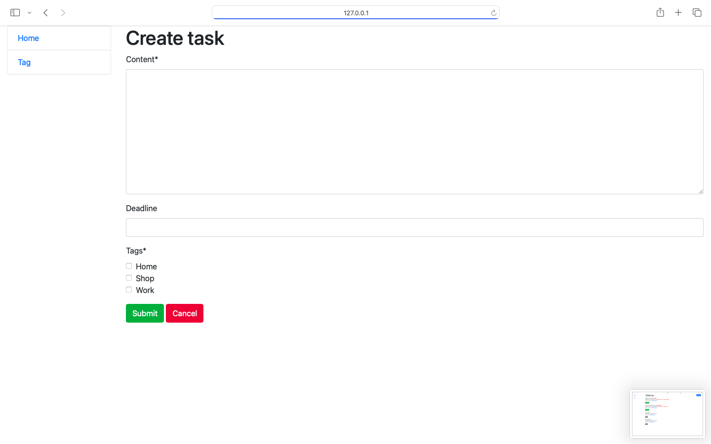
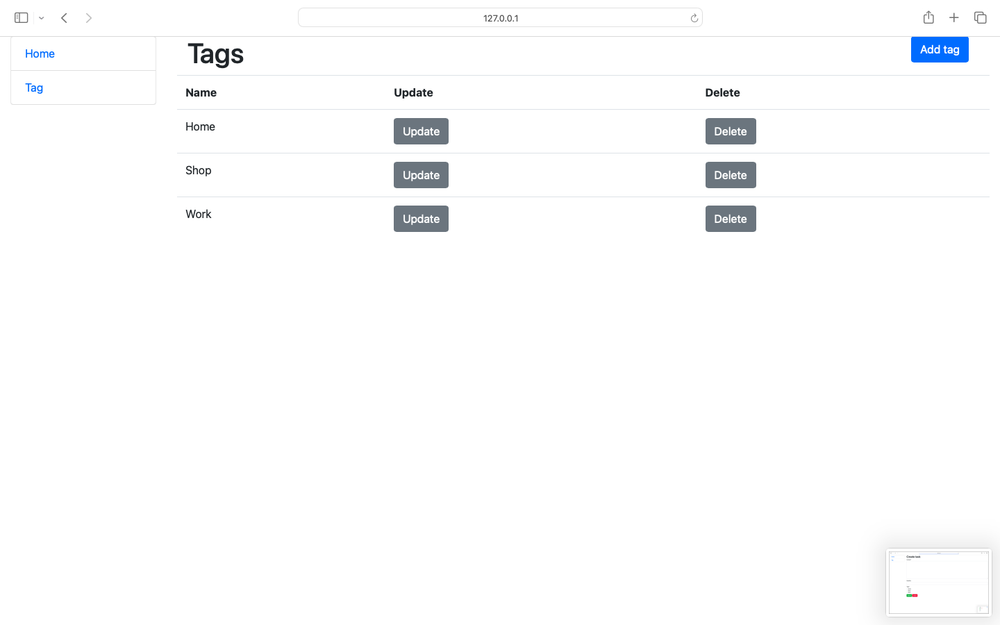

# To do list - Overview


### Login for test
You can login and check functionality of the project using test_user:
```
username:test_user
password:user12345678
```

## Introduction

Welcome to the To do list system! 
Welcome to the task management system! 
Create, edit, and delete tasks, add tags for efficient classification. 
We provide a convenient tool for effective time management and goal achievement. 
Use our system to enhance daily productivity.

## Getting started

Follow these steps to set up and run the NAS project on your local machine:


1. **Clone the Repository:**
   ```bash
   git clone [repository_link]
2. **Navigate to Project Directory:**
    ```bash
   cd path/to/your/directory
3. Open Project in IDE:
Open the project in your preferred Integrated Development Environment (IDE).
4. **Create and Activate Virtual Environment:**
    ```bash
   python -m venv venv
   source venv/bin/activate
5. **Install Dependencies:**
   ```bash
    pip install -r requirements.txt
6. **Create Superuser:**
    ```bash
    python manage.py createsuperuser
7.  **Run Development Server:**
    ```bash
    python manage.py runserver
8. Access the Server:
Open your web browser and go to http://127.0.0.1:8000/ to check and use the server.

#### Screenshots


